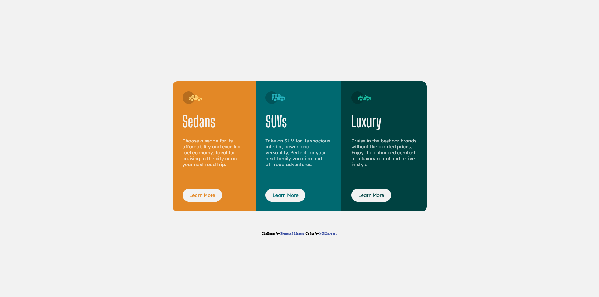

# Frontend Mentor - 3-column preview card component solution

This is a solution to the [3-column preview card component challenge on Frontend Mentor](https://www.frontendmentor.io/challenges/3column-preview-card-component-pH92eAR2-). Frontend Mentor challenges help you improve your coding skills by building realistic projects. 

## Table of contents

- [Overview](#overview)
  - [The challenge](#the-challenge)
  - [Screenshot](#screenshot)
- [My process](#my-process)
  - [Built with](#built-with)
  - [What I learned](#what-i-learned)
- [Author](#author)

## Overview

### The challenge

Users should be able to:

- View the optimal layout depending on their device's screen size
- See hover states for interactive elements

### Screenshot



## My process

### Built with

- Semantic HTML5
- CSS
- Flexbox

### What I learned

I learned that the media query needs to be positioned after the declarations that it changes. 

I also learned that dropping elements like images or buttons into separate containers allows them to maintain their original size when inside a flex area.

```html
<section class="component" id="sedans">
    <div class="image">
      
    </div>
    <h1>Sedans</h1>
    <p>Choose a sedan for its affordability and excellent fuel economy. Ideal for cruising in the city
    or on your next road trip.</p>
    <div class="button">
      <button id="btn-sedan">Learn More</button>
    </div>
  </section>
```

## Author

- Frontend Mentor - [@mjclaypool](https://www.frontendmentor.io/profile/mjclaypool)
