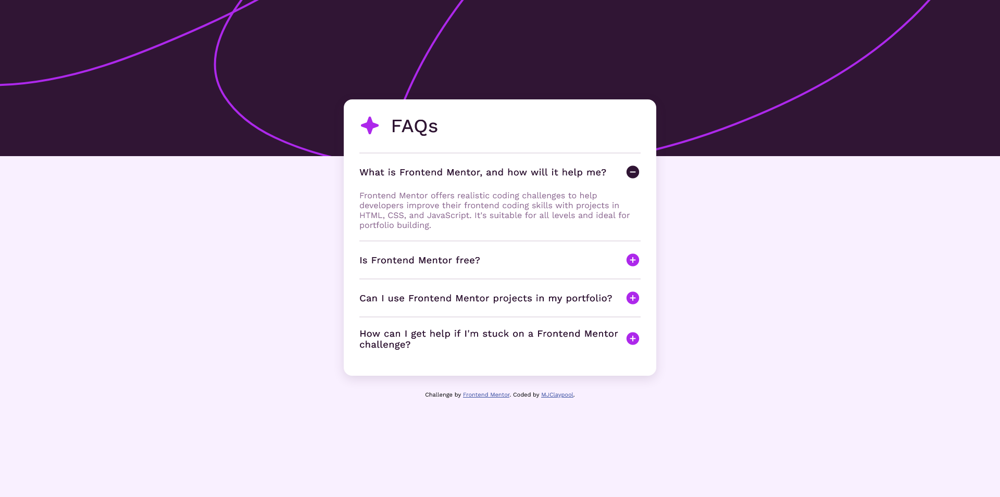
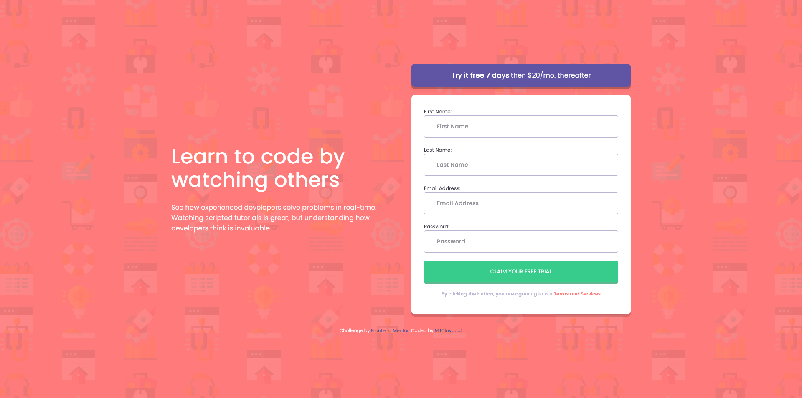
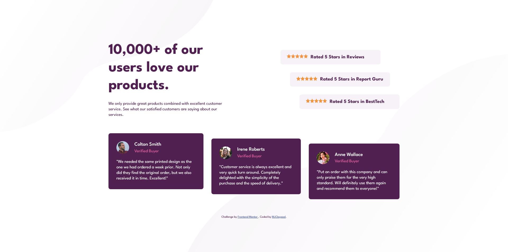
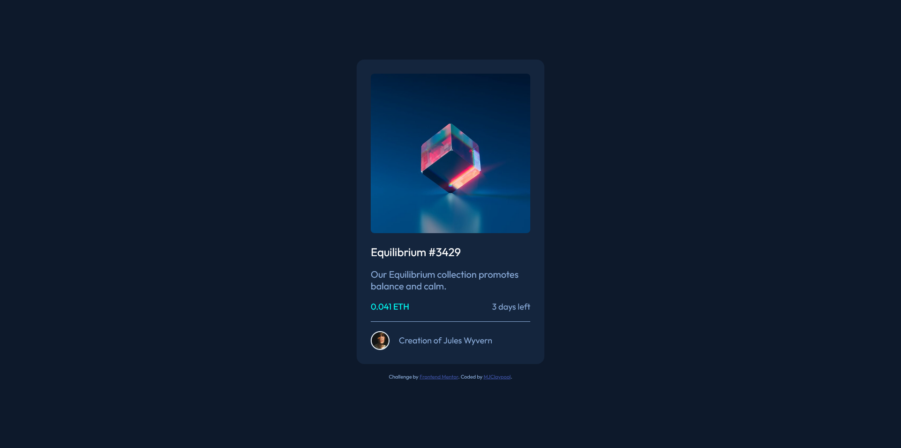
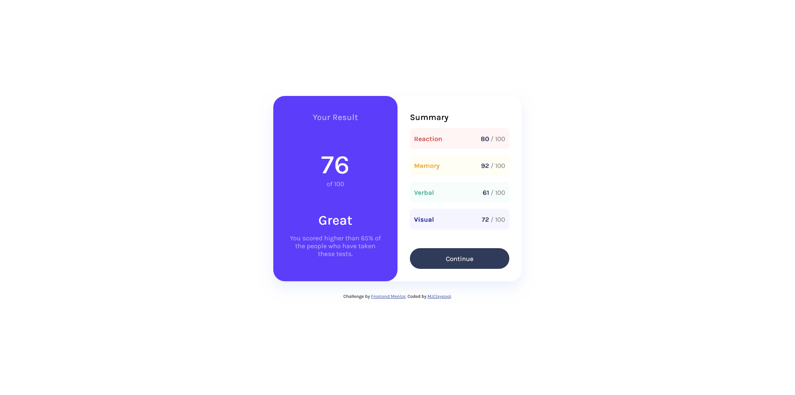

# Frontend-Mentor-Challenges
 Coding challenges completed from the Frontend Mentor website

## Table of contents

- [Overview](#overview)
  - [The challenges](#the-challenges)
  - [Screenshots](#screenshots)
- [My process](#my-process)
  - [Built with](#built-with)
  - [Useful resources](#useful-resources)
- [Author](#author)

## Overview

### The challenges

Common design features across challenges include being able to:

- View the optimal layout for the interface depending on their device's screen size
- See hover and focus states for all interactive elements on the page
- Receive a relevant error message when a form is submitted with invalid input

### Screenshots

## My process

### Built with

- Semantic HTML5
- CSS
- JavaScript

### Useful resources

- [MDN Web Docs - HTML Reference](https://developer.mozilla.org/en-US/docs/Web/HTML) - This reference helped me structure my HTML documents semantically and build form elements. The main site also includes other references, including but not limited to CSS, JavaScript, and Web APIs.

- [W3Schools - CSS Reference](https://www.w3schools.com/cssref/index.php) - This reference helped answer most of my CSS formatting questions. I really like how the site is organized and how explanations are presented.

## Author

- Frontend Mentor - [@mjclaypool](https://www.frontendmentor.io/profile/mjclaypool)